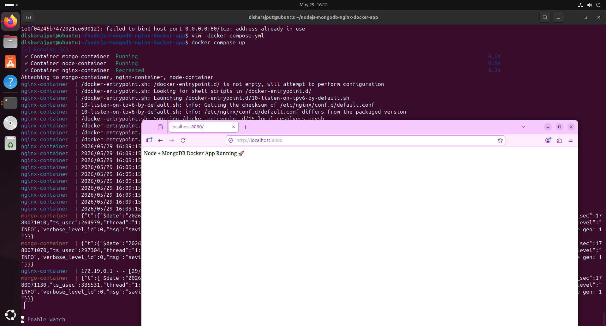
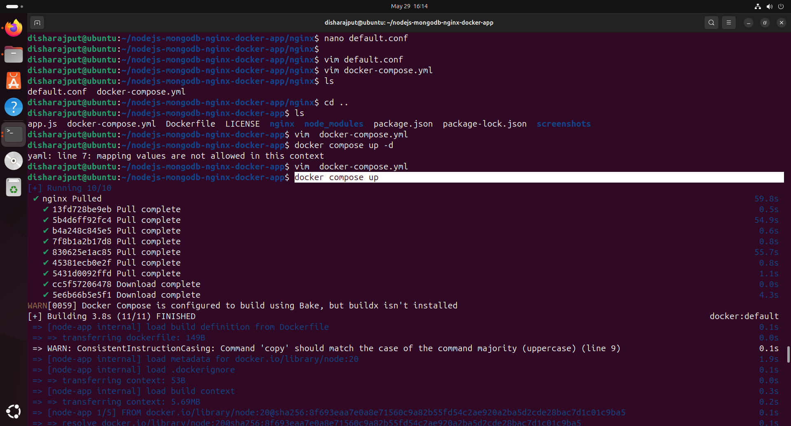
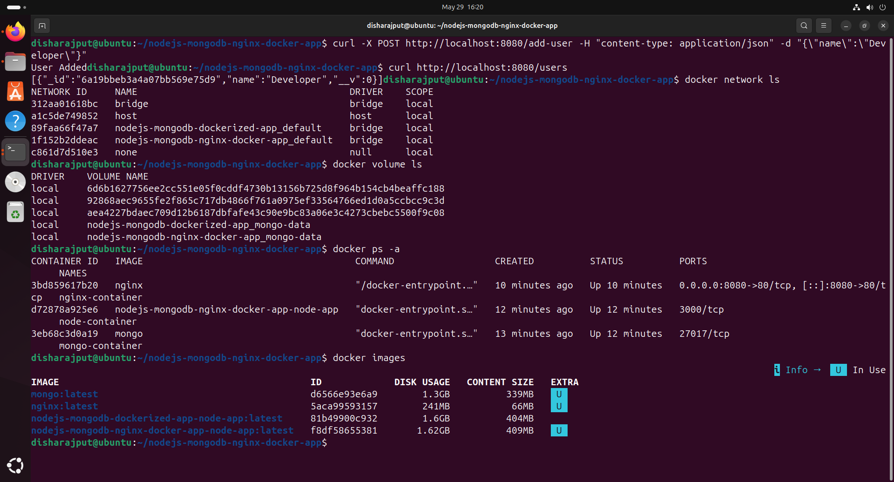

# Node.js + MongoDB + NGINX Reverse Proxy using Docker Compose


A production-style multi-container application built using **Node.js**, **MongoDB**, and **NGINX Reverse Proxy** with **Docker Compose**.

This project demonstrates modern backend container architecture, reverse proxy configuration, service communication, Docker networking fundamentals, and persistent user data storage using MongoDB.

---

# 🚀 Project Overview

This application consists of:

- **Node.js Backend Server**
- **MongoDB Database**
- **NGINX Reverse Proxy**
- **Docker Compose Orchestration**

NGINX acts as a reverse proxy and forwards incoming traffic to the Node.js application container.

The application allows users to be created and stored inside MongoDB through the Node.js backend.

---

# 🏗️ Architecture

```text
User → NGINX Reverse Proxy → Node.js App → MongoDB
```

---

# 📂 Project Structure

```text
node-mongodb-nginx-app/
│
├── app.js
├── package.json
├── package-lock.json
├── Dockerfile
├── docker-compose.yml
│
├── nginx/
│   └── default.conf
│
├── screenshots/
│   ├── browser-output1.png
│   ├── docker-compose1.png
│   └── project-output1.png
│
└── README.md
```

---

# ⚙️ Technologies Used

- Node.js
- Express.js
- MongoDB
- NGINX
- Docker
- Docker Compose

---

# 🐳 Docker Concepts Practiced

- Multi-container applications
- Reverse proxy setup
- Docker networking
- Docker Compose orchestration
- Service-to-service communication
- Container isolation
- Port mapping
- Docker image building
- Environment management

---

# 🔥 Features

- Containerized Node.js backend
- MongoDB database integration
- NGINX reverse proxy configuration
- User creation and storage functionality
- Persistent MongoDB data handling
- Multi-service Docker Compose setup
- Production-style architecture
- Scalable backend foundation

---

# 📦 Installation & Setup

## 1️⃣ Clone Repository

```bash
git clone https://github.com/disharajput2905/node-mongodb-nginx-app.git
cd node-mongodb-nginx-app
```

---

## 2️⃣ Run Containers

```bash
docker-compose up --build
```

---

## 3️⃣ Access Application

Open browser:

```text
http://localhost
```

NGINX will forward requests to the Node.js application internally.

---

# 📸 Screenshots

## 🌐 Browser Output



---

## 🐳 Docker Compose Running Containers



---

## 📁 Project output / Terminal Output



---
---

# 👤 Creating Users in the Application

This project includes a simple API endpoint that allows users to be created and stored inside the MongoDB database through the Node.js backend.

The request is sent through the **NGINX reverse proxy**, which forwards traffic to the Node.js application container internally.

---

## ➕ Add a User

Run the following command in your terminal:

```bash
curl -X POST http://localhost:8080/add-user \
-H "Content-Type: application/json" \
-d '{"name":"Developer"}'
```

---

## 📥 Expected Response

```json
{
  "message": "User Added"
}
```

---

## 📋 Fetch All Users

To view stored users from MongoDB:

```bash
curl http://localhost:8080/users
```

---

## 📤 Example Output

```json
[
  {
    "_id": "6619bbeb3a4a07bb569e75d9",
    "name": "Developer",
    "__v": 0
  }
]
```

---

## 🔍 What Happens Internally

1. Request reaches **NGINX Reverse Proxy**
2. NGINX forwards request to the **Node.js container**
3. Node.js processes request and stores data in **MongoDB**
4. MongoDB persists user data inside the database container

This demonstrates real-world backend container communication using Docker networking.

---

## 📸 API Demonstration

Example terminal output showing user creation and retrieval:

```markdown

```


---

# 🧠 Learning Outcomes

Through this project, I learned:

- How reverse proxies work using NGINX
- Docker Compose multi-container orchestration
- Node.js and MongoDB container communication
- How backend applications store user data
- Docker networking fundamentals
- Production-style backend architecture
- Containerized application deployment

---

# 🛠️ Future Improvements

- Add Redis caching
- Implement JWT authentication
- Add monitoring with Prometheus & Grafana
- Deploy on AWS EC2
- Configure HTTPS with SSL
- Add CI/CD using GitHub Actions

---

# 👩‍💻 Author

**Disha Rajput**

---

# ⭐ Support

If you found this project useful, consider giving it a star ⭐ on GitHub.
